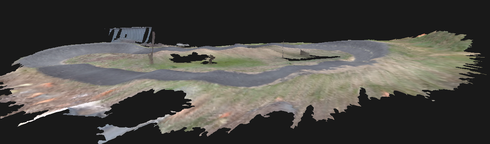

# Roboracer SLAM with ZED Cameras

> **Stereolabs ZED SLAM integration with the Roboracer Platform**

```
Platform:   NVIDIA Jetson · ROS 2 Humble
Camera:     ZED X
Language:   Python 3 & C++
```
---

  
## Overview

This repo contains a lightweight and minimal implementation of VSLAM and meshing with the Stereolabs ZED cameras, set up to work with the Roboracer (previously F1Tenth) platform.  It a robust 3D localization solution for the Roboracer platform.  Due to the edge compute constraints of the Roboracer platform, this package contains the minimal stack needed to allow mapping/localization with ZED cameras.  For those needing more comprehensive topics and fine-grain control, the [ZED ROS2 wrapper](https://github.com/stereolabs/zed-ros2-wrapper) provides that support at the cost of higher compute.  This repo also details integration with other F1Tenth systems needed to run a full autonomy stack on the Roboracer platform. Information on setting up the ZED hardware can be found in the [SETUP.md](./documentation/SETUP.md) file.  ZED SDK documentation can be found [here](https://www.stereolabs.com/docs/zed-ecosystem).
  
<p align="center">
  <br/>
  <em>F1Tenth car with mounted ZEDX.</em>
</p>

---

## Nodes

### `zed_slam_node`

 The primary node for positional tracking, publishes pose + spatial memory status. It leverages the ZED SDK's Gen 3 tracking engine for improved loop closure and drift correction.

| Parameter | Type | Default | Description |
|---|---|---|---|
| `fps` | int | `30` | Camera framerate |
| `resolution` | string | `SVGA` | Camera resolution (`HD2K`, `HD1080`, `SVGA`) |
| `depth_mode` | string | `NEURAL_LIGHT` | Neural Depth Model used for depth estimation|
| `area_file` | string | `''` | Path to `.area` map file |
| `initial_mapping` | bool | `false` | If true, builds a new map instead of localizing on provided area file|
| `update_map` | bool | `false` | If true, saves/updates area file after mapping/localization is completed|


**Published Topics**

| Topic | Type | Description |
|---|---|---|
| `/zed/zed_node/pose` | `geometry_msgs/PoseStamped` | Camera pose in map frame |
| `/zed/spatial_memory_status` | `diagnostic_msgs/DiagnosticArray` | Spatial memory state changes |
| `/zed/path` | `nav_msgs/msg/Path` | Path taken when mapping/localizing

**Broadcast Transforms**

| From | To |
|---|---|
| `map` | `zed_camera_link` |

---

### `zed_record`

Records ZED camera output to an `.svo2` file for offline meshing.

| Argument | Default | Description |
|---|---|---|
| `--fps` | `60` | Camera framerate |
| `--resolution` | `SVGA` | Camera resolution |
| `--dir` | `/home/nvidia/.../data/svo` | Output directory |
| `--output` | `test.svo2` | Output filename |

---

## Setup
### Installation

```bash
mkdir ~/f1tenth_ws/src
cd ~/f1tenth_ws/src
git clone git@github.com:jtappen1/zed-slam.git
cd ~/f1tenth_ws
colcon build --packages-select zed_slam
source install/setup.bash
```

---

## Usage
  
### Mapping (build new map)
Follow the steps in [MAPPING.md](./documentation/MAPPING.md)

### Localization (existing map)
Follow the steps in [LOCALIZATION.md](./documentation/LOCALIZATION.md)

### Lifetime Mapping (adding to an existing map)
There is a section on lifetime mapping in [LOCALIZATION.md](./documentation/LOCALIZATION.md)


### Recording .SVO2

```bash
python zed_record.py --fps 30 --resolution SVGA --dir /path/to/output
```

---

## Localization Metrics (AGX Orin)

| Resolution | FPS | Pose Hz | CPU Usage | RAM Usage |
|------------|-----|--------|----------|-----------|
| SVGA       | 60  | ~40 Hz | 70–140% | ~2–3% |
| SVGA       | 120 | ~25 Hz | 150–200+% | ~2–3% |
| HD 1080    | 30  | ~30 Hz | 70–140% | ~2–3% |
| HD 1080    | 60  | ~40 Hz | 100–140% | ~2–3% |
| HD 1200    | 30  | ~25 Hz | 100–140% | ~2–3% |
| HD 1200    | 60  | ~20 Hz | 150–200+% | ~2–3% |

---

## Meshing

The ZED SDK support generating high fidelity meshes through both on and offline spatial mapping. More documentation can be found in the [ZED Spatial Mapping docs](https://www.stereolabs.com/docs/spatial-mapping), but through testing accurate meshes have been created by recording a .svo2 file of the area and using Stereolab's ZEDfu application to perform offline spatial mapping of the area.  The best meshing is done by carrying the camera at stable height and walking slowly through the area. Through the .svo2 file and ZEDfu application, positional tracking is automatically calculated and can be used to create both area files and meshes of the area.

<p align="center">
  <br/>
  <em>Example of a mesh generated of an outdoor track using the above method.</em>
</p>

---

## Map (.area) Files
More information on .area files and the VSLAM mapping process can be found on the [ZED SDK docs](https://www.stereolabs.com/docs/positional-tracking/area-memory)

---

## Troubleshooting (In Progress)

| Symptom | Likely Cause | Fix |
|---|---|---|
| `ZED Camera failed to open` | Camera not connected or permissions | Check USB/power, run `ZED_Explorer` |
| Tracking state `LOST` immediately | Bad area file or wrong starting pose | Re-map or clear area file |
| No topics publishing | Node crashed silently | Check `ros2 node list` and logs |
