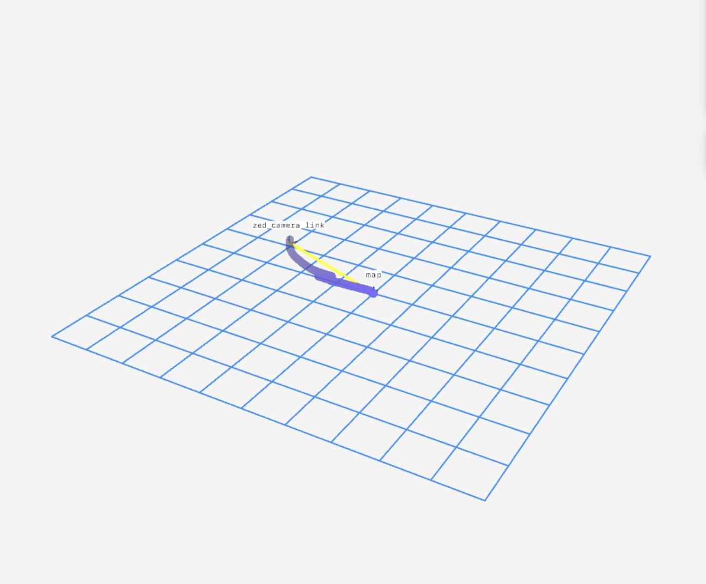

# Localization

> **Note:** This guide assumes you have already completed the setup
> steps for the F1/10th system in a parallel workspace and the mapping
> steps in `MAPPING.md`.

------------------------------------------------------------------------

## 1. Start Up System

Ensure that the bringup script and Foxglove bridge are running.

------------------------------------------------------------------------

## 2. Set Desired Configuration

Navigate to:

    ../config/localize.yaml

Ensure the correct area file path is set under `area_file`.

> **Important:** Maps can only be localized using the **same resolution
> and depth model** used during mapping.

------------------------------------------------------------------------

## 3. Start the SLAM Script

Start localization from a **feature-dense area**, preferably the same
location where mapping began. This improves convergence from
`INITIALIZING` to `KNOWN_MAP`.

Launch SLAM in localization mode:

``` bash
ros2 launch zed_slam zed_slam.launch.py mode:=localize
```

------------------------------------------------------------------------

## 4. Visualizing Localization

If setup is correct, open Foxglove and verify that the camera frame
appears in the correct position.

### Plot Overview

Use the **spatial mapping status** to monitor localization performance.

### Mapping States

-   `INITIALIZING`: System is starting up
-   `KNOWN_MAP`: Vehicle is localized with high confidence
-   `MAP_UPDATE`: Entered an unmapped area; system falls back to VIO and
    adds new frames
-   `LOST`: Tracking failure; manually return to a known area

<p align="center">
  <br/>
  <em>Example inital position when localized.</em>
</p>

### Spatial Mapping Status Key

``` python
{
  "INITIALIZING": 0,
  "KNOWN_MAP":    1,
  "LOOP_CLOSED":  2,
  "MAP_UPDATE":   3,
  "LOST":         4,
  "UNKNOWN":     -1,
}
```

Additional details:
https://www.stereolabs.com/docs/positional-tracking/positional-tracking-status#spatial_memory_status-vslam-status

------------------------------------------------------------------------

## 5. Localization Procedure

-   On startup, the system begins in `INITIALIZING`
-   Once it transitions to `KNOWN_MAP`, begin driving along a path
    similar to your mapping trajectory

If the state switches to `MAP_UPDATE`, the environment likely needs
additional mapping.

To extend the map, run:

``` bash
ros2 launch zed_slam zed_slam.launch.py mode:=lifetime
```

When stopped, the system updates the area file with newly captured
frames and poses.

Continue driving until localization performance is validated.

To stop:

``` bash
Ctrl + C
```

------------------------------------------------------------------------

## 6. Lifetime Mapping

Running SLAM with the `lifetime` mode enables continuous map updates.

Use this to: - Improve coverage in poorly mapped areas - Expand the
existing map

**Best practice:** - Start in a known area - Gradually move into new
regions

More information:
https://www.stereolabs.com/docs/positional-tracking/area-memory#lifelong-mapping
