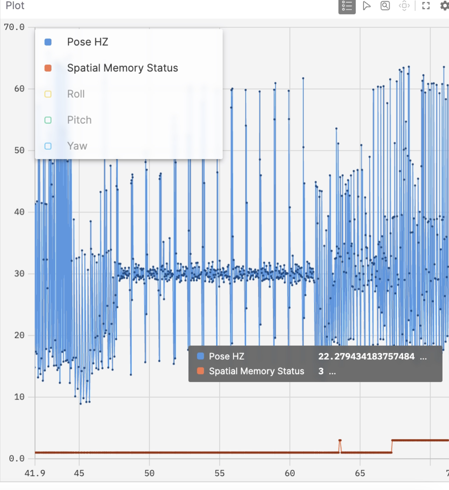

# Mapping

> **Note:** This guide assumes you have already completed the setup
> steps for the F1/10th system in a parallel workspace.

------------------------------------------------------------------------

## 1. Set Desired Configuration

Navigate to:

    ../config/localize.yaml

Set your desired mapping configuration.

-   Recommended: **1080p (HD) at 60 FPS** for optimal performance.
-   Ensure consistency between mapping and localization settings.

> **Important:** Maps can only be localized using the **same resolution
> and depth model** used during mapping.

------------------------------------------------------------------------

## 2. Start the SLAM Script

Launch SLAM in mapping mode:

``` bash
ros2 launch zed_slam zed_slam.launch.py mode:=mapping
```

------------------------------------------------------------------------

## 3. Visualizing the Mapping

1.  Download the layout file:

        ../data/layout/zed_slam.json

2.  Forward the Foxglove bridge port:

``` bash
ssh -L 8765:localhost:8765 <YOUR_USER>@<YOUR_IP>
```

3.  Open Foxglove:
    -   Connect to: `ws://localhost:8765`
    -   Import the downloaded `zed_slam.json` layout
4.  Configure visualization:
    -   Set **Fixed Frame** = `map`
    -   Set **Display Frame** = `map`
    -   Visualize topic: `/zed/path`

### Plot Overview

The right-side plot displays: - Roll, pitch, yaw - Spatial mapping
status - Output pose frequency (Hz)

Use the **spatial mapping status** to monitor mapping and localization
performance.

### Mapping States

-   `INITIALIZING`: System is starting up
-   `MAP_UPDATE`: Actively mapping (you can begin driving)
-   Other states indicate localization or tracking conditions

<p align="center">
  <br/>
  <em>Example plot seen when mapping.</em>
</p>

### Spatial Mapping Status Key

``` python
{
  "INITIALIZING": 0,
  "KNOWN_MAP":    1,
  "LOOP_CLOSED":  2,
  "MAP_UPDATE":   3,
  "LOST":         4,
  "UNKNOWN":     -1,
}
```

Additional details:
https://www.stereolabs.com/docs/positional-tracking/positional-tracking-status#spatial_memory_status-vslam-status

------------------------------------------------------------------------

## 4. Mapping Procedure

Drive the vehicle through the environment while following these
guidelines:

-   Maintain at least **1 meter distance** from walls and obstacles
-   Ensure smooth, continuous motion
-   Avoid rapid rotations or abrupt movements
-   Aim to complete at least one **loop closure**

For best results:
https://www.stereolabs.com/docs/positional-tracking/area-memory#mapping-procedure-best-practices

------------------------------------------------------------------------

## 5. Saving the Map

Once mapping is complete:

1.  Ensure a loop closure has occurred (recommended)
2.  Stop the SLAM process:

``` bash
Ctrl + C
```

This will automatically save the map.

You can then proceed to localization using:

    LOCALIZATION.md
